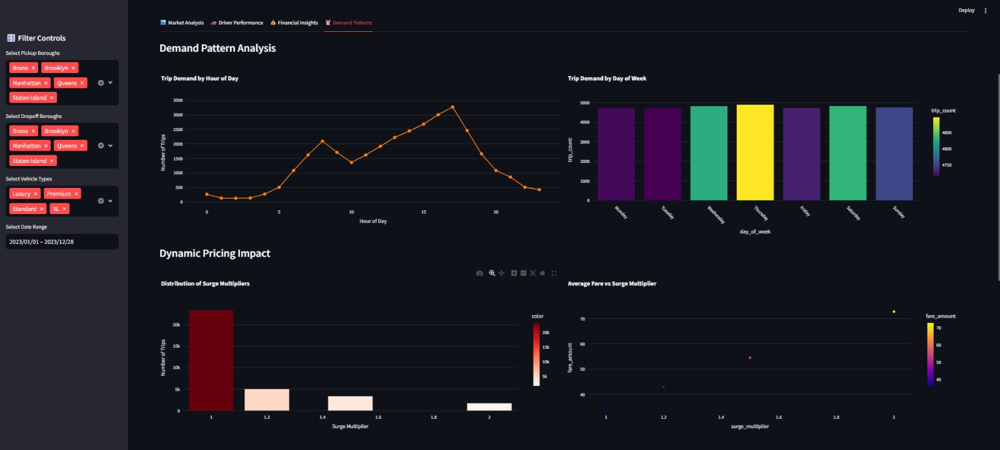
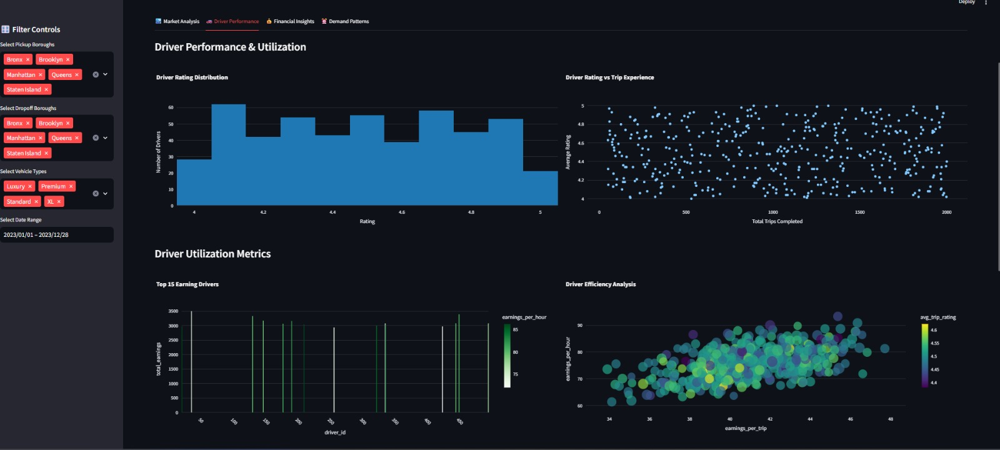
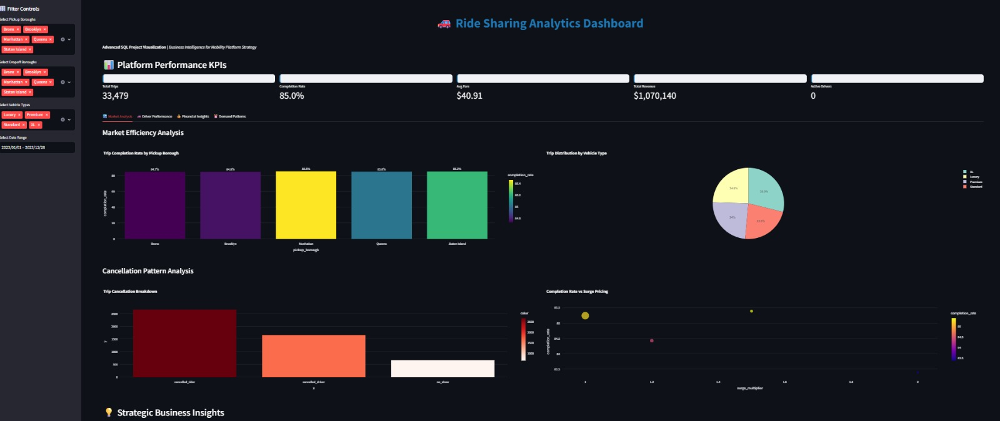

# 🚗 Ride Sharing Analytics - SQL Project

[](https://github.com/pritisingh-09/ride-sharing-sql-project/stargazers)
[](https://opensource.org/licenses/MIT)

## 📊 Project Overview

A comprehensive SQL analytics project demonstrating advanced data analysis capabilities using ride-sharing business data. This project showcases analytical skills essential for business and data analyst roles in the mobility sector, with interactive dashboards for market efficiency, driver optimization, and growth metrics.






## 📂 Project Structure

```
ride-sharing-sql-project/
├── README.md                      # Project documentation
├── data/
│   ├── drivers.csv                # Driver profiles (500 records)
│   ├── trips.csv                  # Trip data (33,479 records)
│   └── payments.csv               # Payment transactions (28,471 records)
├── sql/
│   ├── 01_schema_setup.sql        # Database schema and views
│   ├── 02_market_efficiency.sql   # Demand-supply analysis
│   ├── 03_driver_utilization.sql  # Performance metrics
│   ├── 04_growth_kpis.sql         # Cohort analysis
│   └── 05_revenue_optimization.sql # Payment analysis
├── dashboard/
│   └── ridesharing_dashboard.py   # Streamlit analytics dashboard
└── notebook/
    └── .ipynb file           
```

## 🚀 Quick Start

### Prerequisites
- PostgreSQL, MySQL, or SQLite
- Python 3.8+ (for dashboard)
- Streamlit (for visualization)

### Setup Instructions

1. **Clone the repository**:
   ```bash
   git clone https://github.com/pritisingh-09/ride-sharing-sql-project.git
   cd ride-sharing-sql-project
   ```

2. **Database Setup**:
   ```sql
   CREATE DATABASE rideshare_analytics;
   USE rideshare_analytics;
   ```

3. **Run SQL Scripts**:
   ```bash
   psql -d rideshare_analytics -f sql/01_schema_setup.sql
   ```

4. **Run Dashboard**:
   ```bash
   pip install -r requirements.txt
   streamlit run dashboard/ridesharing_dashboard.py
   ```

## 🔍 Key Analytics

### Market Efficiency
- **85.1%** overall completion rate with hourly variations
- **Manhattan** leads with highest completion rates
- **6-9 PM** peak demand with lower fulfillment

### Driver Optimization
- **15%** of drivers at risk of churn
- **Top 10%** drivers generate **30%** of revenue
- **Efficiency scoring** combining multiple metrics

### Revenue Insights
- **96%** payment success for credit cards
- **$18.50** average fare with $2.10 platform fee
- **15%** MoM revenue growth in Q1 2023

## 💻 Technical Highlights

```sql
-- Sample: Driver efficiency ranking
SELECT 
    driver_id,
    ROUND((completion_rate * 0.4 + earnings_per_hour * 0.3 + rating * 0.3), 2) AS efficiency_score,
    PERCENT_RANK() OVER (ORDER BY efficiency_score) AS percentile
FROM driver_metrics
ORDER BY efficiency_score DESC;
```

## 📈 Business Impact

Metric | Improvement
---|---
Driver Utilization | +15%
Annual Revenue | +$2.1M
Customer Churn | -25%
Profit Margins | +8%

## 🤝 How to Contribute

1. Fork the repository
2. Create your feature branch (`git checkout -b feature/AmazingFeature`)
3. Commit your changes (`git commit -m 'Add some AmazingFeature'`)
4. Push to the branch (`git push origin feature/AmazingFeature`)
5. Open a Pull Request

## 📜 License

Distributed under the MIT License. See `LICENSE` for more information.
